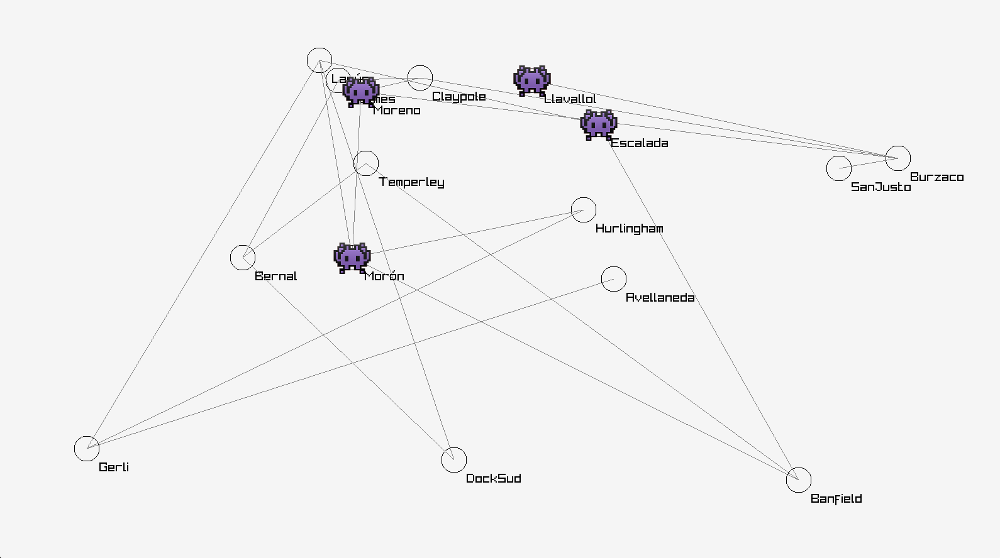
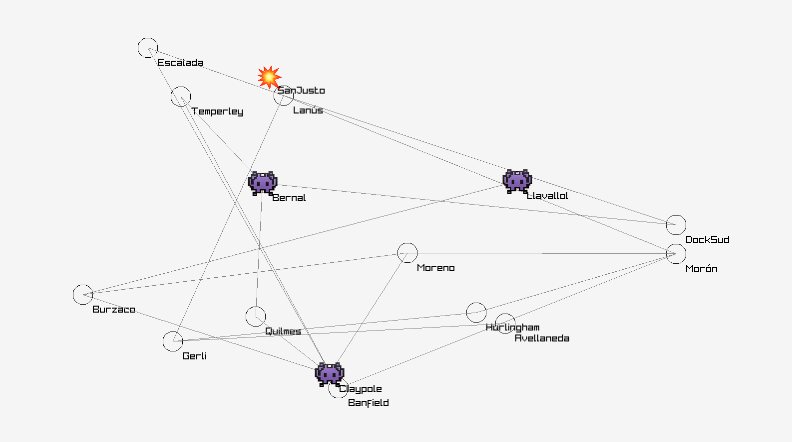

# Alien Invasion

### Description

Given a config file, this simulation generates a map with interconnected cities in which aliens will take turns to move from one place to another.



On each turn, each alien will randomly pick a neighbor city and move there. If they find that other alien is already in that city, a fight will take place and both the aliens and the city will be destroyed as a result.

When a city is destroyed, it is removed from the map, and so are any roads that lead into or out of it.



Once a city is destroyed, aliens can no longer travel to or through it. This may lead to aliens getting "trapped".

The command line argument `n` determines how many aliens are generated and placed randomly on the map.

### Events

Events are logged to stdout in the following format:

```
🚷 Alien 1 is trapped forever in Gerli
👾 Alien 2 moved from Avellaneda to Lanús
👀 Alien 2 found Alien 3 in Escalada
💥 Escalada has been destroyed by Alien 2 and Alien 3
```

### Usage

You can run the simulation with `go run main.go` using the following flags:

```
-path string
    path to the config file (default "config.json")
-n int
    number of aliens for the simulation (default 5)
-movements int
    how many iterations this simulation is going to run (default 10000)
-directed
    use a directed graph (default false)
```
